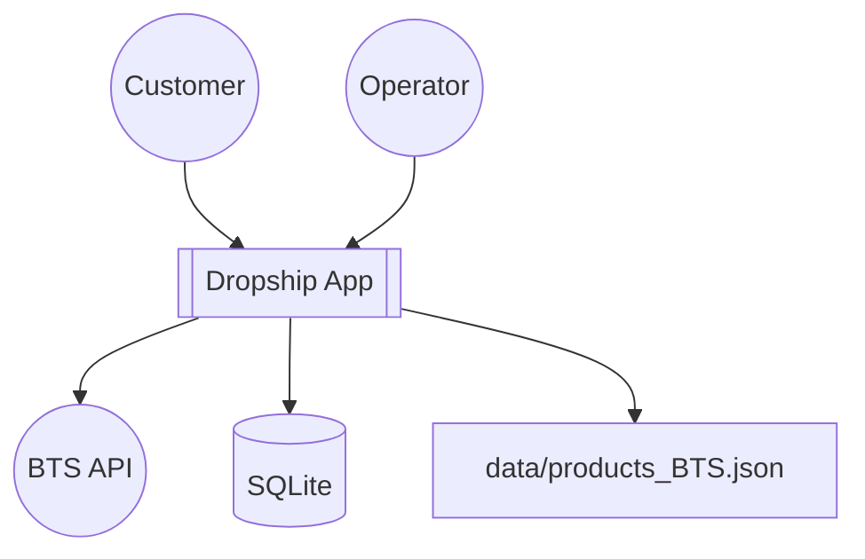
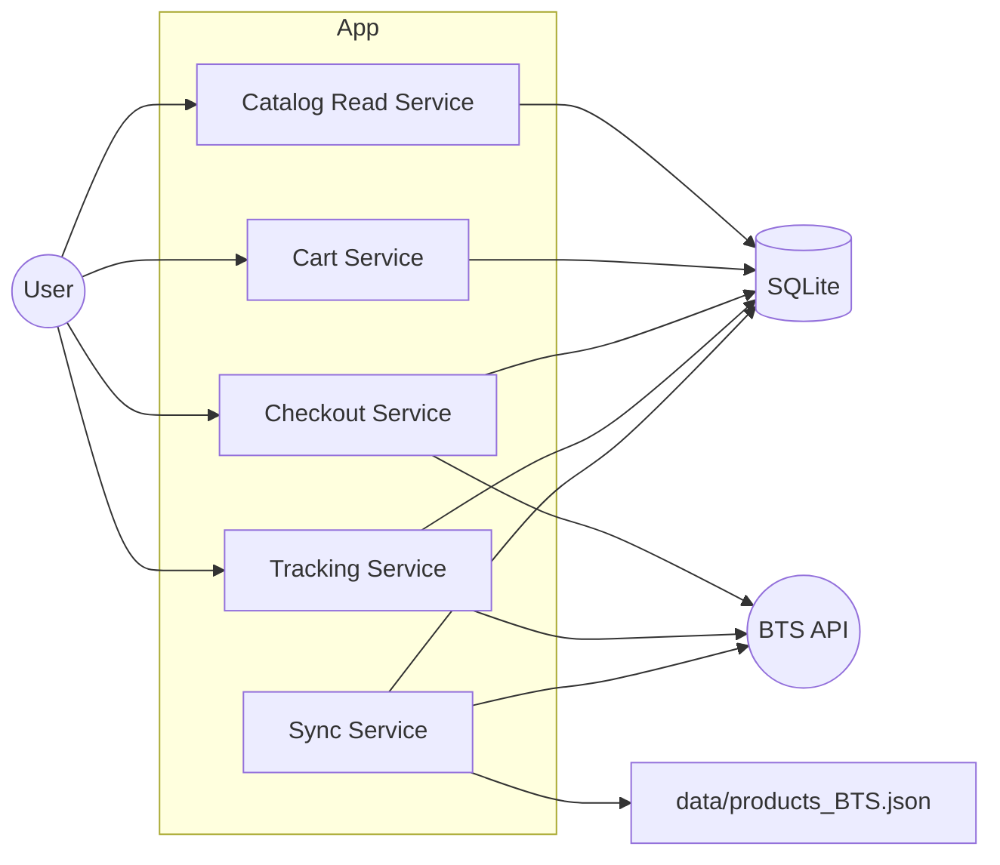
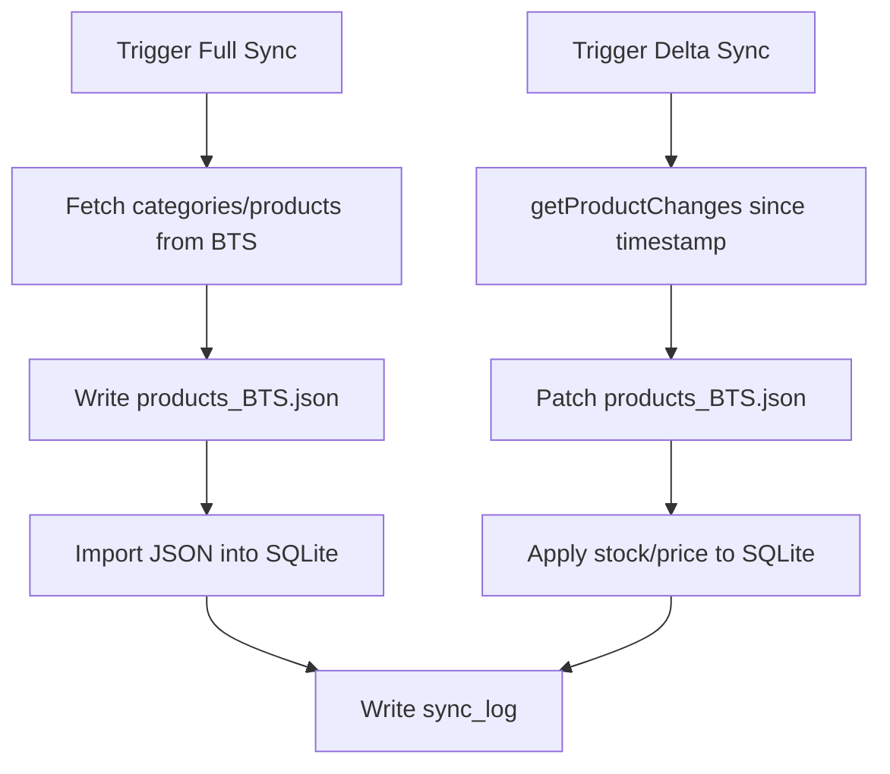
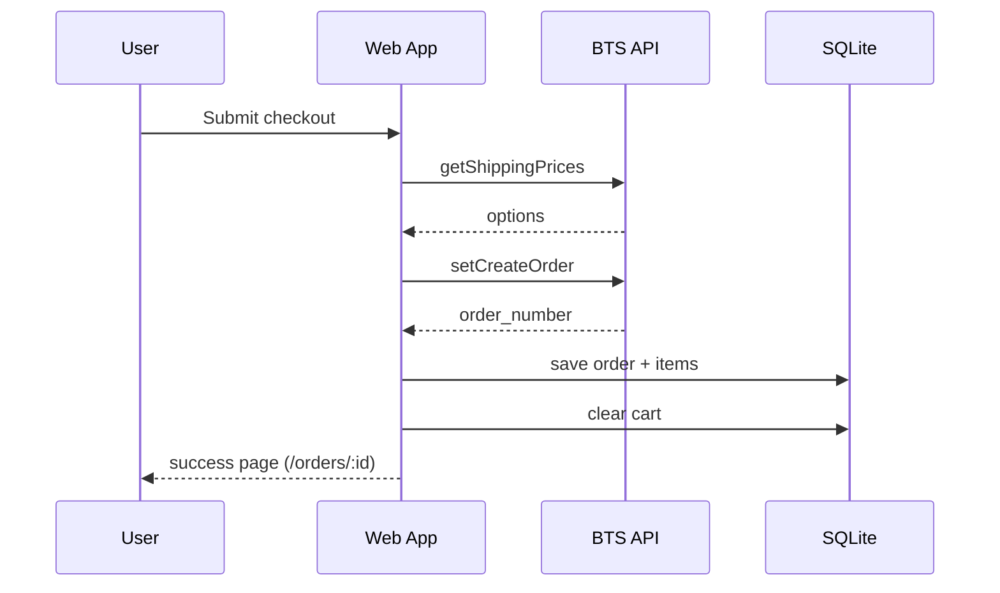
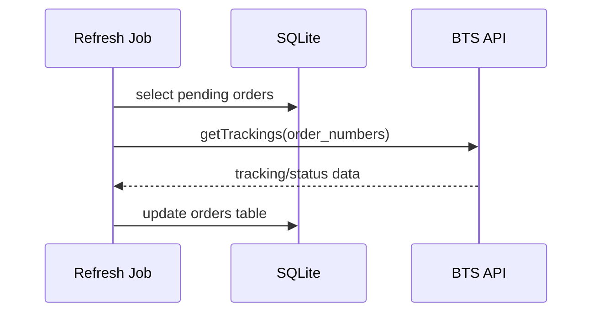

# 02 - Architecture And Diagrams

## System context (DFD - Context)

```mermaid
flowchart TD
  User((Customer)) --> System[[Dropship App]]
  Admin((Operator)) --> System
  System --> BTS((BTS API))
  System --> DB[(SQLite)]
  System --> JSON[data/products_BTS.json]
```

## DFD Level 1

```mermaid
flowchart LR
  subgraph App
    Catalog[Catalog Read Service]
    Cart[Cart Service]
    Checkout[Checkout Service]
    Tracking[Tracking Service]
    Sync[Sync Service]
  end

  User((User)) --> Catalog
  User --> Cart
  User --> Checkout
  User --> Tracking

  Catalog --> DB[(SQLite)]
  Cart --> DB
  Checkout --> DB
  Tracking --> DB
  Sync --> DB

  Checkout --> BTS((BTS API))
  Tracking --> BTS
  Sync --> BTS
  Sync --> JSON[data/products_BTS.json]
```

## Sync dataflow

```mermaid
flowchart TD
  A[Trigger Full Sync] --> B[Fetch categories/products from BTS]
  B --> C[Write products_BTS.json]
  C --> D[Import JSON into SQLite]
  D --> E[Write sync_log]

  F[Trigger Delta Sync] --> G[getProductChanges since timestamp]
  G --> H[Patch products_BTS.json]
  H --> I[Apply stock/price to SQLite]
  I --> E
```

## Checkout swimlane

```mermaid
sequenceDiagram
  participant U as User
  participant W as Web App
  participant B as BTS API
  participant D as SQLite

  U->>W: Submit checkout
  W->>B: getShippingPrices
  B-->>W: options
  W->>B: setCreateOrder
  B-->>W: order_number
  W->>D: save order + items
  W->>D: clear cart
  W-->>U: success page (/orders/:id)
```

## Tracking refresh flow

```mermaid
sequenceDiagram
  participant Job as Refresh Job
  participant DB as SQLite
  participant BTS as BTS API

  Job->>DB: select pending orders
  Job->>BTS: getTrackings(order_numbers)
  BTS-->>Job: tracking/status data
  Job->>DB: update orders table
```
