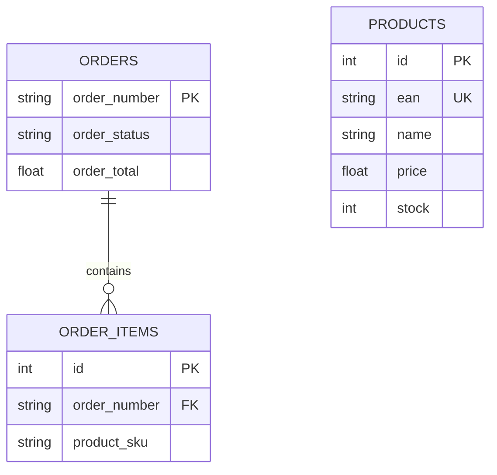

# 03 - Data Model And SQLite

## Primary tables

1. `products` - catalog cache (ean, name, price, stock, etc.)
2. `categories` - category tree
3. `orders` - local order mirror (order_number key)
4. `order_items` - lines for each order
5. `cart` - session-based cart
6. `sync_log` - full/delta run metadata

## ERD



## JSON artifact contract

File: `data/products_BTS.json`

```json
{
  "generated_at": "ISO_DATE",
  "mode": "full|delta",
  "count": 47265,
  "products": []
}
```

## Index strategy

1. `products(ean)` unique
2. `products(manufacturer)`
3. `products(stock)`
4. `products(price)`
5. `cart(session_id)`
6. `order_items(order_number)`

## Migration approach

1. Keep schema init script idempotent (`CREATE TABLE IF NOT EXISTS`).
2. Add new columns with defaults.
3. Never drop columns in-place until data migration is complete.
