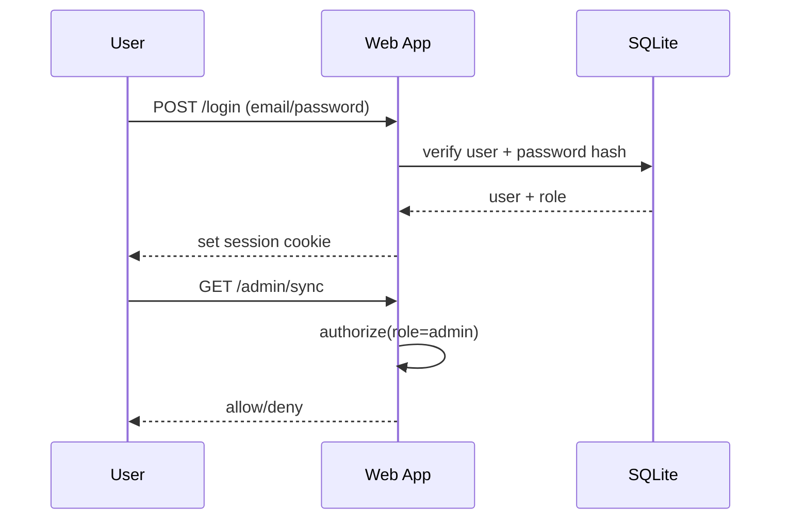

# 08 - Authentication And Authorization

Add auth once core commerce flow is stable.

## Threat model basics

1. BTS token leakage (critical)
2. Unauthorized admin actions (sync, order refresh)
3. Session hijacking
4. CSRF on form POST routes

## Identity model

Roles:
1. `guest` - browse/cart/checkout
2. `customer` - own order history
3. `admin` - sync, refresh, diagnostics

## Authorization matrix

| Capability | guest | customer | admin |
|---|---:|---:|---:|
| Browse products | ✅ | ✅ | ✅ |
| Cart/checkout | ✅ | ✅ | ✅ |
| View own orders | ❌/optional | ✅ | ✅ |
| Refresh tracking all | ❌ | ❌ | ✅ |
| Run sync jobs | ❌ | ❌ | ✅ |

## Auth implementation options

1. **Session cookies** (recommended for SSR app)
2. JWT (recommended for SPA/API clients)
3. Hybrid: session for web, JWT for API integrations

## Required controls

1. Store BTS token in server env only.
2. Hash passwords with strong algorithm.
3. `httpOnly`, `secure`, `sameSite` cookies.
4. CSRF token for state-changing forms.
5. Rate limit login and sensitive endpoints.
6. Audit log for admin actions.

## Auth flow diagram

## Incremental rollout

1. Start with admin-only auth for operations pages.
2. Add customer accounts later for order history.
3. Add API tokens only if exposing public APIs.
